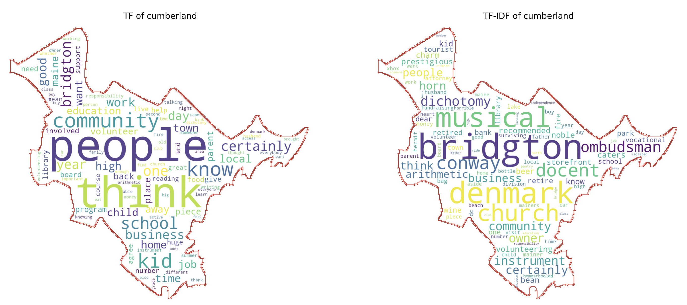
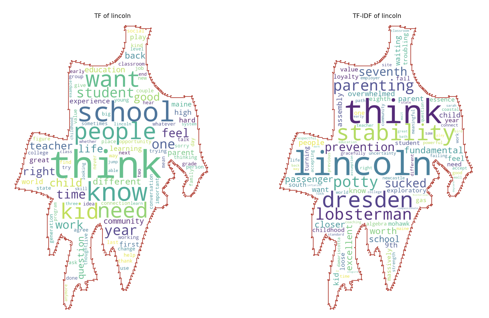
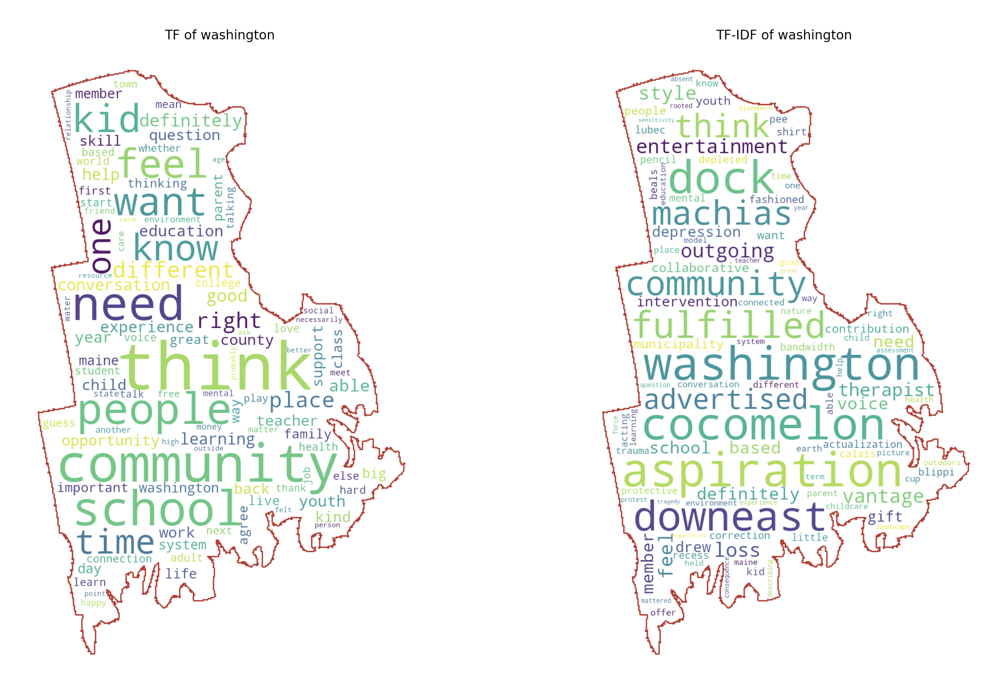

# DS5110 Final Project: Education ACTION Forum of Maine

* Stakeholder: Jennifer Chace (Executive Director)
* Contributors: James Kim and Daryle Lamoureux (The Roux Institute at Northeastern University)

## Disparities Identified in Language Usage in Maine Counties
[ADD SHOWING THE DIFFERENCES IN SOME OF THE CONVERSATIONS ... like York County, Cumberland County and Aroostok or Kennebec counties]

[ADD IMAGES TO SHOW WHAT'S HIGHLIGHTED ABOVE]

## Words Matter
A word may only be spoken once or twice during a lengthy conversation. Oftentimes this results in the word being disregarded. Words that are spoken the least during a conversation, however, may be critical to understanding the subtext or underlying tone of a conversation. This is even more powerful when looking at these less spoken words all together within the context of a conversation. This method used in this project looked at both the words that were spoken the most during a conversation and words that were spoken less often. The analysis of the two different methods side by side in some cases demonstrates what was stated previously -- the less spoken words can paint a very different picture of the conversation that took place. As an example, below is the analysis of Somerset County, which is a rural, northern county in Maine.

The analysis on the left of the most common words shows words that would be expected in a conversation about education, such as school, education, teacher, and community. The analysis on the right of the least common words shows the struggles that the community is experiencing and its impact on education. The words include: pregnant, anxiety, divorce, tension, recover, survival, and resilience. By examining the least common words used, this could provide insight for follow up conversations within Somerset and other counties.
